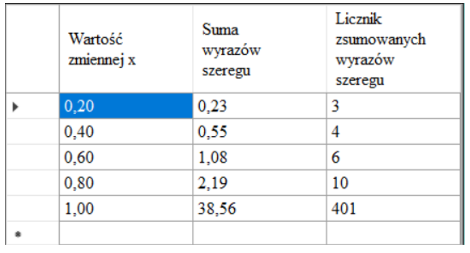

  
This is the formula by which you need to calculate the functions

  
  
Here are all the Entry Conditions

  

 

  
How is the formula implemented in Visual Studio

  
  
  
  
Tabulating

  
  
  
Graphic drawing

  
  

